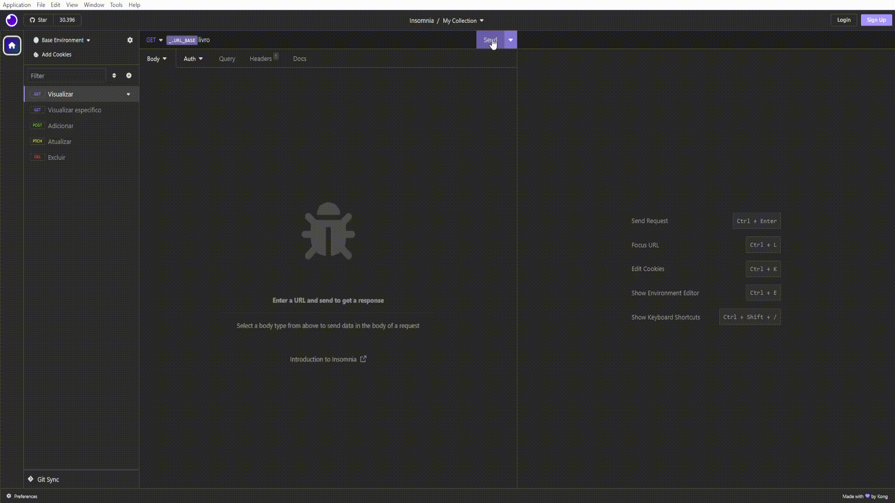
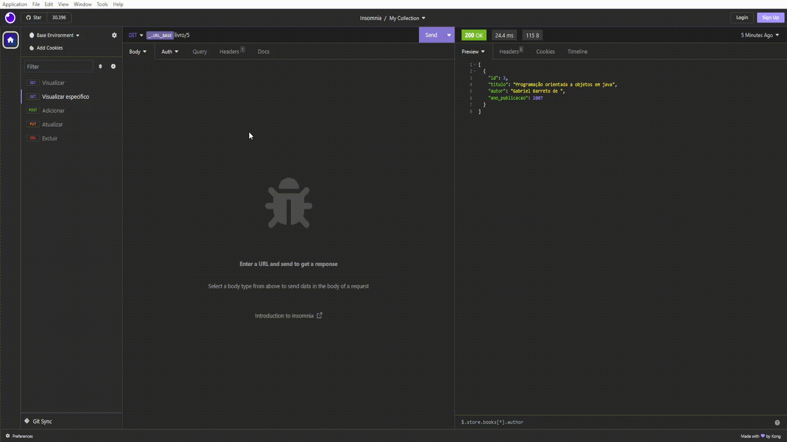
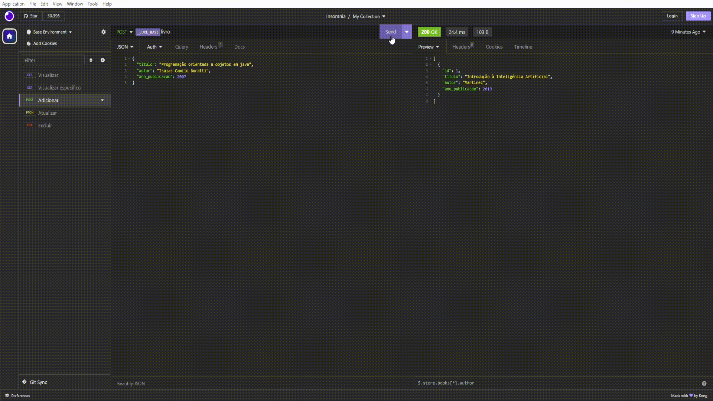
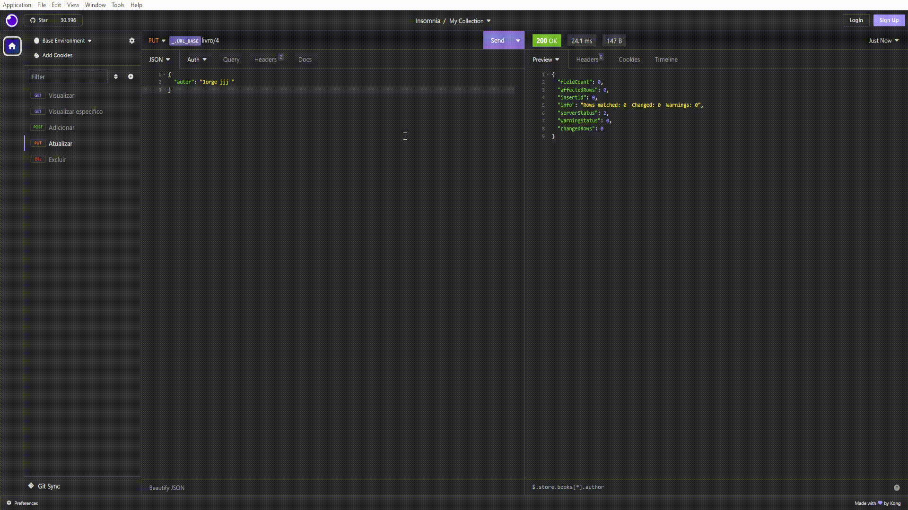
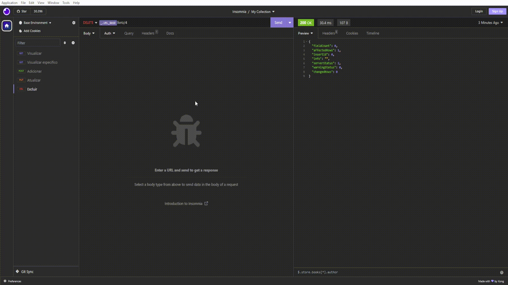

<div align="center" >
  
  # BookList - Listador de livros
<div>
  
[](https://github.com/Cyacer/BookList)
[](https://pypi.python.org/pypi/ansicolortags/) 
  
</div>

  ### Este projeto foi desenvolvido em  junto do banco de dados  para listar livros cujo você tem ou já tenha lido de forma simples.
  
 ### No momento não é capaz de armazenar imagens, mas futuramente será capaz, sendo assim espero que gostem e leia toda a documentação para saber o que deve configura antes de utilizar.
</div>
<div align="center" >

<h3>
  
 | Comando              | Descrição                |
 | -------------------- | ------------------------ |
  | `npm install`| Para instalar as bibliotecas  que seram utilizadas para iniciar a Api    |
 | `npm start`| Inicialização do Servidor     |
 
</h3> 
<h2 align="center">Rotas</h2>
<h3>
  
  
 | Metodo               | Caminho               |  Descrição               |
 | -------------------- | --------------------  | ------------------------ |
 | GET              |        `/livro`       | Puxa todos os livros criado.|
 | GET              |       `/livro/:id`    | Puxa um livro expecifico com base no id.|
 | POST             |       `/livro`        | Cadastra os livros. |
 | PUT              |       `/livro/:id`    | Alterar / Atualizar um ou mais dados especifico do livro.|
 | DELETE           |       `/livro/:id`    | Exclui todo livro com base no seu id.|
 
</h3> 

<h2 align="center">Configuração</h2>

Nesta etapa primeiro iremos criar a Database  no banco  cujo será utilizado pela Api:

<h3>
  
```

CREATE DATABASE BookList;

 USE BookList;

 CREATE TABLE livros (

    id INT AUTO_INCREMENT PRIMARY KEY,

    titulo VARCHAR(100) NOT NULL,

    autor VARCHAR(100),

    ano_publicacao INT);

```
Logo após a criação do Database, iremos configurar o arquivo .process.env, cujo carregar as variável relacionadas a conexão com a Database e porta que api rodará:

 | Variável             | Descrição                |
 | -------------------- | ------------------------ |
 | HOST | Aonde irá colocar o ip caso seja diferente do padrão|
 | PORT | Aonde irá colocar a porta cujo seu Database está rodando|
 | USER | Aonde irá colocar o usuário do seu banco de dados|
 | PASSWORD | Aonde irá colocar a senha do usuário do seu banco de dados|
 | DATABASE | Aonde irá colocar  nome da sua Database|
 | SERVERPORT | Aonde irá colocar a porta cujo Api iniciará|
 
</h3>
<div>
  <h2>Exemplo das Rotas</h2>
    <h3>Visualizar Todos</h3>
    <h4>Método GET utilizado para puxa todos os livros criado.</h4>
  
    <h3>Visualizar Específico</h3>
  <h4>Método GET utilizado para puxa um livro específico a partir do ID.</h4>
  
  <h3>Adicionar</h3>
  <h4>Método POST cadastra os livros.</h4>
  
    <h3>Atualizar</h3>
  <h4>Método PUT  alterar / atualizar um ou mais dados especifico do livro.</h4>
  
    <h3>Deletar</h3>
  <h4>Método DELETE utilizado para excluir um livro específico a partir do ID.</h4>
  
</div>
</div>
